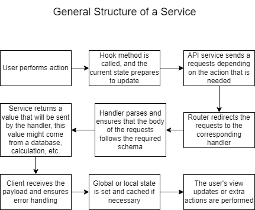

# Learn Software Architecture for Long-Term Maintainability

## Purpose

This repository demonstrates how to design and implement software architectures that support long-term maintainability. While the app itself is a finance management tool, the primary focus is on applying advanced architectural principles to enhance scalability, readability, and maintainability in real-world projects.

## Target Audience

This material is tailored for students and medium-advanced developers interested in improving their understanding of:
- Service architectures
- Custom React hooks
- Object-Oriented Programming (OOP)
- Design patterns
- Object-Relational Mappers (ORMs)

---

## Table of Contents

- [Learn Software Architecture for Long-Term Maintainability](#learn-software-architecture-for-long-term-maintainability)
  - [Purpose](#purpose)
  - [Target Audience](#target-audience)
  - [Table of Contents](#table-of-contents)
  - [Prerequisites](#prerequisites)
  - [Key Topics](#key-topics)
  - [Visual Guide](#visual-guide)
  - [Resources](#resources)
  - [Feedback](#feedback)

---

## Prerequisites

Before diving into this repository, ensure you are familiar with:
- **TypeScript**
- **Prisma**
- **React.js**

If you're new to these tools, refer to the [Resources](#resources) section for documentation links.

---

## Key Topics

This repository covers the following concepts:
1. **Service Architectures**: Structuring your app into modular and reusable services.
2. **Custom React Hooks**: Writing reusable hooks to manage state and side effects.
3. **Object-Oriented Programming (OOP)**: Using OOP principles to structure your codebase.
4. **Design Patterns**: Implementing common patterns for better maintainability and scalability.
5. **Object-Relational Mappers (ORMs)**: Leveraging Prisma to interact with databases efficiently.

---

## Visual Guide

To help you understand the concepts, this repository includes:
- Diagrams of service architectures.
- Visual explanations of design patterns.

---

## Resources

Enhance your learning with the following resources:
- [TypeScript Documentation](https://www.typescriptlang.org/docs/)
- [React Documentation](https://react.dev/learn)
- [Design Patterns for Humans](https://github.com/kamranahmedse/design-patterns-for-humans)

---

## Feedback

Have questions or suggestions? Please open a GitHub Issue in this repository. Your feedback is valuable!

---

Happy learning!
